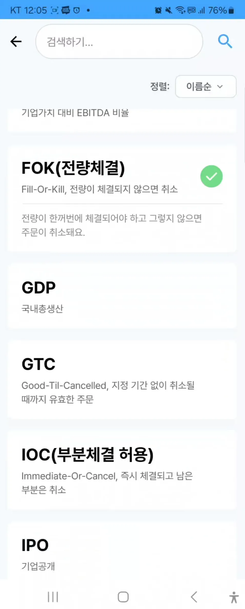

<div align="center">

# 📈 라고할때 - 모의투자 학습 서비스
주식투자 초보자를 위한 모의투자 학습 어플리케이션


</div>


# ✍️ 개요
- **서비스명**: 라고할때
- **프로젝트 기간:** 2025. 07.07 ~ 2025.08.18
- **SSAFY 13기 공통 프로젝트**
- **목표:** 주식 투자 초보자를 위해 알기 쉬운 용어로 직관적이게 표현한 학습 기능과 실제 주가 정보를 연동한 모의 투자 기능으로 실전 경험을 쌓을 수 있는 어플리케이션

[▶️ 영상 포트폴리오 보러가기](https://youtu.be/wsXnRQZ3P1M)

## ✍️ 프로젝트 소개

## 📽️ 주요 기능 시연

### 1️⃣ 메인 화면


<br>
<br>


### 2️⃣ 모의투자


<br>
<br>


<br>
<br>


### 3️⃣ 차트 패턴 분석


### 4️⃣ 학습



<br>
<br>


<br>
<br>


### 5️⃣ 역사 챌린지


### 6️⃣ 뉴스


### 7️⃣ 성향별 매매봇 


### 8️⃣ 마이페이지


## ✨기술적 특징
### 1. 웹소켓 구독 기능을 사용한 부하 방지

- 한국 투자 증권 API를 이용해 실제 주가 정보를 연동하고 웹소켓을 통해 사용자 화면에 지연 없이 전달 → 한 번에 많은 양의 데이터를 실시간으로 전달하게 되면 네트워크와 렌더링에 부하 발생
- 웹소켓 구독 기능을 활용해 보이는 종목은 구독하고 스크롤 되어 화면 밖으로 사라진 종목은 구독 해제하는 방식으로 렌더링 최적화 → 자원을 효율적으로 사용하고 매끄러운 사용 흐름 제공

### 2. PostgreSQL + TimescaleDB 활용

- 시계열 데이터 최적화
    - TimescaleDB: PostgreSQL 기반 시계열 데이터베이스 확장
    - Hypertable: 주가 데이터를 시간 기준으로 자동 파티셔닝
    - Continuous Aggregates: 실시간 OHLCV 집계로 차트 성능 극대화
    - 성능 비교 테스트 (18만건 부하 테스트)
        - MySQL Insert: 26분
        - PostgreSQL: 7초 (222배 성능 향상)
        - 생산성 + 성능 동시 향상
    - 시계열 데이터 처리 최적화
        - 자동 압축: 오래된 데이터 자동 압축으로 스토리지 효율성
        - 병렬 처리: 다중 종목 동시 데이터 삽입
        - 인덱스 최적화: 시간 기반 쿼리 성능 극대화
    - 실시간 집계 기능
        - 1분/3분/5분/15분/30분/1시간/1일 단위 자동 집계
        - Materialized View: 복잡한 기술적 분석 쿼리 사전 계산
        - 메모리 효율: 대용량 틱 데이터를 효율적으로 처리
    
    이를 통해 대용량 실시간 주가 데이터를 안정적이고 빠르게 처리할 수 있는
    시스템을 구축했습니다.
    

### 3. 차트 패턴 분석

- 단순 가격 비교가 아닌 선형회귀와 추세선이라는 통계적 지표를 확인하여 추세선을 그리고 기울기와 결정 계수를 활용해 차트 패턴을 탐지 → 사용자가 상승/하락 추세를 직관적으로 파악할 수 있음

### 4. 데일리 퀴즈

- 매일 랜덤한 시간에 데일리 퀴즈 알람을 사용자에게 전송

### 5. 뉴스

- KR-FinBERT 감정분석
    - 국내 금융 특화 모델인 KR-FinBERT를 활용한 호재/악재 분석
    - 실시간 뉴스 크롤링 (구글 RSS + Selenium) → 감정점수 도출 (-1.0 ~ 1.0)
    - AI 자동매매봇의 핵심 판단 지표로 활용
    - 마이크로서비스 아키텍처 도입
        - 문제상황: 로컬 환경에서는 정상 동작했으나, 배포 서버 통합 시 타임아웃
        및 성능 저하 발생
        - 원인: 여러 서버 동시 실행으로 인한 과도한 리소스 사용
        - 해결책: Spring 서버 내장 방식 → 독립 Flask 서버로 분리
    - 성능 최적화 결과
        - Spring 서버 메모리: 8.1GB → 3.4GB (58% 절약)
        - 시스템 부하: 47% → 21% (55% 감소)
        - 응답속도: 타임아웃 해결 및 안정적 서비스 제공
    - 서비스 분리 아키텍처
        - Spring Boot: 메인 API 서버 (Port 8081)
        - Flask: FinBERT 감정분석 전용 서버 (Port 5000)
        - 통신: HTTP REST API로 마이크로서비스 간 연동
        - Docker Compose: 통합 컨테이너 관리로 배포 자동화

### 6. 성향별 매매봇

- 매매로직
    - 뉴스 감정분석: 구글 RSS + Selenium + FinBERT
        - 실시간 뉴스 크롤링으로 호재/악재 점수 산출 → 점수 정규화 (-1.0 ~
        1.0)
    - 기술적 분석: 다중 지표 통합 분석
        - RSI, MACD, 볼린저밴드, 이동평균선, 골든/데드 크로스
        - Java 21 Virtual Thread 활용 병렬 계산으로 고성능 처리
- 통합 매매 신호 생성
    - 뉴스 감정 점수 + 기술적 분석 점수 + 실시간 가격 변동을 종합
    - 캐릭터별 차별화된 가중치로 개성있는 매매 신호 생성
    - Redis Stream 기반 비동기 매매 실행으로 지연 없는 거래
- 캐릭터별 전략
    - 화끈이 (공격형): 뉴스 감정분석 1.3배 가중 → 긍정 신호에 강한 반응
    - 적극이 (성장형): 기술적분석 1.2배 가중 → RSI, MACD 중심 매매
    - 균형이 (중립형): 뉴스/기술 동등 비중 → 안정적 포트폴리오
    - 조심이 (보수형): 부정 신호 1.5배 가중 → 위험 회피 중심 매매
- 매분 자동 실행
    - Spring 스케줄러로 매분마다 전체 AI 봇 매매 실행
    - 실시간 KIS WebSocket 가격 연동으로 정확한 매매가 적용


# ⚙️ 기술 스택


<!-- LAGO 기술 스택 (핵심 기술만) -->
<!-- LAGO 기술 스택 -->
<table>
  <tr>
    <th>분류</th>
    <th>기술 스택</th>
  </tr>

  <!-- 모바일(Android) -->
  <tr>
    <td><b>모바일(Android)</b></td>
    <td>
      
      
      
      
      
      
      
    </td>
  </tr>

  <!-- 백엔드(Spring) -->
  <tr>
    <td><b>백엔드</b></td>
    <td>
      
      
      
      
      
      
      
    </td>
  </tr>

  <!-- 네트워크 & API -->
  <tr>
    <td><b>네트워크·API</b></td>
    <td>
      
      
      
      
      
    </td>
  </tr>

  <!-- 데이터베이스 -->
  <tr>
    <td><b>데이터베이스</b></td>
    <td>
      
      
      
      
    </td>
  </tr>

  <!-- AI/데이터 -->
  <tr>
    <td><b>AI·데이터</b></td>
    <td>
      
      
      
      
      
      
      
    </td>
  </tr>

  <!-- 인프라 -->
  <tr>
    <td><b>인프라·DevOps</b></td>
    <td>
      
      
      
      
      
    </td>
  </tr>

  <!-- 협업도구 -->
  <tr>
    <td><b>협업도구</b></td>
    <td>
      
      
      
      
    </td>
  </tr>
</table>

# ⚒️ 시스템 아키텍처


## Android 패키지 구조
```markdown
com.lago.app/
├── data/                          # 데이터 레이어
│   ├── cache/                     # 캐시 관리 (차트, 관심종목, 실시간 데이터)
│   ├── local/                     # 로컬 데이터
│   │   ├── dao/                   # Room DAO
│   │   ├── entity/                # Room Entity
│   │   └── prefs/                 # SharedPreferences
│   ├── remote/                    # 원격 데이터
│   │   ├── api/                   # API 서비스 인터페이스
│   │   ├── dto/                   # 데이터 전송 객체
│   │   └── websocket/             # WebSocket 연결
│   ├── repository/                # Repository 구현체
│   ├── scheduler/                 # 스케줄러
│   └── service/                   # 데이터 서비스
│
├── di/                           # 의존성 주입 모듈
│
├── domain/                       # 도메인 레이어
│   ├── entity/                   # 도메인 엔티티
│   ├── repository/               # Repository 인터페이스
│   └── usecase/                  # 비즈니스 로직 UseCase
│
├── fcm/                         # Firebase 메시징
│
└── presentation/                 # 프레젠테이션 레이어
    ├── ui/                       # UI 컴포넌트
    │   ├── chart/                # 차트 관련 UI
    │   │   ├── state/            # 차트 상태 관리
    │   │   └── v5/               # 차트 v5 구현 (TradingView 커스터마이징)
    │   ├── components/           # 공통 UI 컴포넌트
    │   ├── historychallenge/     # 역사 챌린지 화면
    │   ├── home/                 # 홈 화면
    │   ├── login/                # 로그인 화면
    │   ├── news/                 # 뉴스 화면
    │   ├── personalitytest/      # 성향 테스트 화면
    │   └── study/                # 학습 관련 화면
    │       └── Screen/           # 학습 세부 화면
    └── viewmodel/               # ViewModel
        └── history/             # 거래 이력 관련 ViewModel
```


## BackEnd 패키지 구조
```markdown
  BE/src/main/java/com/example/LAGO/
  ├── LagoApplication.java                    # Spring Boot 메인 클래스
  │
  ├── ai/                                    # AI 서비스 모듈
  │   ├── sentiment/                         # FinBERT 감정분석
  │   │   └── dto/
  │   └── strategy/                          # AI 매매 전략
  │       └── dto/
  │
  ├── config/                               # 설정 클래스
  │   # Spring Security, WebSocket, Redis, KIS API 등
  │
  ├── controller/                           # REST API 컨트롤러
  │   # 인증, 주식매매, AI봇, 계좌, 차트, 뉴스, 포트폴리오 등
  │
  ├── domain/                               # JPA 엔티티
  │   ├── converter/                        # 엔티티 변환기
  │   # 사용자, 계좌, 주식, 매매, AI전략, 뉴스, 시계열 데이터 등
  │
  ├── dto/                                  # 데이터 전송 객체
  │   ├── request/                          # 요청 DTO
  │   └── response/                         # 응답 DTO
  │
  ├── repository/                           # JPA 리포지토리
  │   # 각 도메인별 데이터 접근 계층
  │
  ├── realtime/                            # 실시간 데이터 처리
  │   └── dto/                             # 실시간 데이터 DTO
  │   # KIS WebSocket, Redis Stream, 분봉처리, TimescaleDB 등
  │
  ├── service/                             # 비즈니스 로직
  │   # 자동매매봇, 기술적분석, 매매, 계좌, 포트폴리오 등
  │
  ├── kis/                                 # 한국투자증권 연동
  │   # KIS 인증, WebSocket, 실시간 연결 등
  │
  ├── scheduler/                           # 스케줄링 작업
  │   # 데일리 퀴즈, 뉴스 수집, 자산 업데이트 등
  │
  ├── utils/                               # 유틸리티
  │   # 기술적분석 계산, 매매 관련 유틸 등
  │
  ├── exception/                           # 예외 처리
  │   # 글로벌 예외 핸들러, 커스텀 예외 등
  │
  ├── converter/                           # 데이터 변환
  │   # 날짜/시간, 문자열 변환기 등
  │
  └── constants/                           # 상수 정의
```

## 프로젝트 산출물 및 메뉴얼

- 포팅 메뉴얼 (exec 폴더 참고)
- [기능 명세서](https://www.notion.so/237085cabd3480fea27ce09b3c59625c?pvs=21)
- [와이어 프레임](https://www.figma.com/design/utXuqPzMOWMkrvwPFUTlTF/%EB%9D%BC%EA%B3%A0%ED%95%A0%EB%95%8C-%EC%99%80%EC%9D%B4%EC%96%B4%ED%94%84%EB%A0%88%EC%9E%84?node-id=0-1&t=ge4MRh3gd1kZeJVe-1)
- [API 명세서](https://www.notion.so/API-22a085cabd348039bc81edc6ec3eeeec?pvs=21)
- [ERD](https://dbdiagram.io/d/689d9e061d75ee360a90baed)
- [시퀀스 다이어그램](https://www.notion.so/22a085cabd3480678fd8cd9a8e29707a?pvs=21)
- [간트 차트](https://docs.google.com/spreadsheets/d/1wQ9IBqwJeYietFdrB4bGjVusZWbprBePGl_xuRKNgzI/edit?usp=sharing)

## 팀원 소개


<table>
  <tr>
    <th>김수진</th>
    <th>김해민</th>
    <th>박경찬</th>
    <th>박승균</th>
    <th>박준형</th>
    <th>최혜림</th>
  </tr>
  <tr>
    <td></td>
    <td></td>
    <td></td>
    <td></td>
    <td></td>
    <td></td>
  </tr>
  <tr>
    <td>
      - 팀장, PM<br>- 중간/최종 발표<br>- PPT 제작<br>- UI/UX 디자인<br>- 기능 명세서 작성<br>- 간트 차트 작성<br><br>
      <b>[Android]</b><br>- 마이페이지 화면<br>- 포트폴리오 화면<br>- 랭킹 화면<br>- 뉴스 화면<br><br>
      <b>[BE]</b><br>- 계좌 조회 API<br>- 관심 뉴스 API
    </td>
    <td>
      - 캐릭터 디자인<br><br>
      <b>[BE]</b><br>- 실시간 주가 API<br>- 차트 조회 API<br>- 관심 종목 추가 API<br>- Entity 생성
    </td>
    <td>
      - 프로젝트 기획 및 PL <br>- 시퀀스 다이어그램 작성<br><br>
      <b>[Android]</b><br>- 투자 메인 화면<br>- 모의투자 화면<br>- 역사적 챌린지 화면<br><br>
      <b>[BE]</b><br>- 주식 거래 API<br>- 실시간 뉴스 처리 API
    </td>
    <td>
      <b>[Android]</b><br>- 메인화면<br>- 학습 화면<br>- 포트폴리오 화면<br>- 랭킹<br>- FCM 알림<br><br>
      <b>[Backend]</b><br>- 단어장/퀴즈<br>- 소셜 로그인<br><br>
      <b>[AI]</b><br>- 뉴스 감정 분석
    </td>
    <td>
      <b>[Infra]</b><br>- 서버환경 구축<br>- 서버 최적화<br><br>
      <b>[DB]</b><br>- DB 설계 및 최적화<br><br>
      <b>[BE]</b><br>- 성향별 매매봇 API
    </td>
    <td>
      - 문서 작성<br>- API 설계 및 명세서 작성<br><br>
      <b>[BE]</b><br>- 차트 패턴 분석 API<br>- 역사적 챌린지 API
    </td>
  </tr>
</table>


